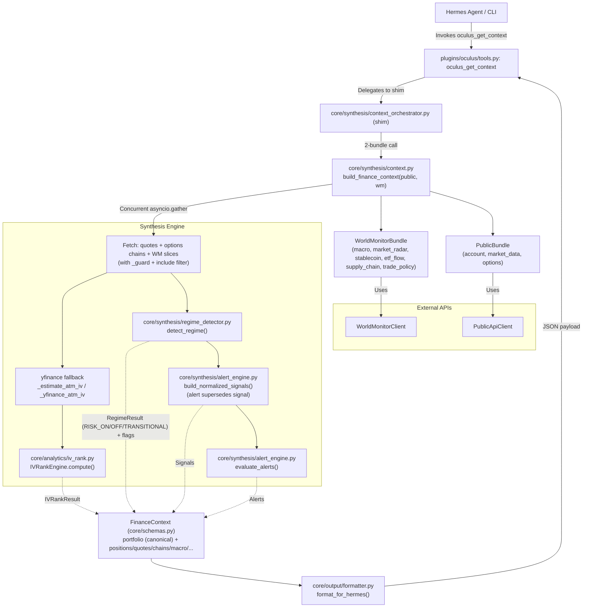
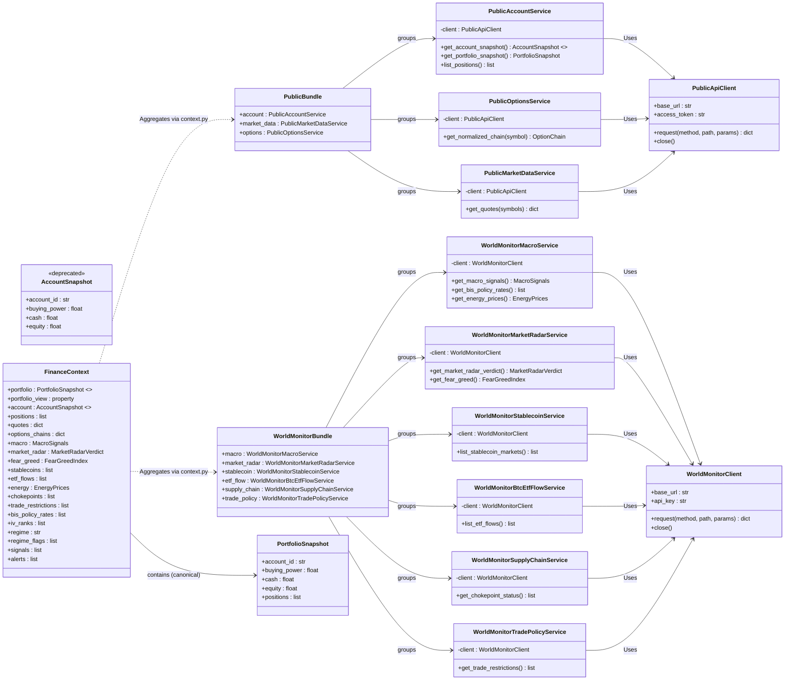

<div align=center>

# Agent Oculus

Agent Oculus is an open-source financial context engine designed to provide fast, readable, and actionable market signals. It acts as a modular synthesis layer for financial data, enabling retail traders to monitor portfolios, track macro regimes, and build custom investment workflows using Hermes Agent.


</div>

## Core Capabilities

Agent Oculus provides structured financial signals to inform decision-making:

- **Portfolio Context:** Integrates with brokerage APIs to track real-time positions, buying power, and account health.
- **WorldMonitor Macro Intelligence:** Connects to WorldMonitor feeds to track global macro regimes, stablecoin peg stability, and critical supply chain chokepoints.
- **Volatility Analysis:** Real-time IV rank and percentile monitoring to identify high-volatility regimes.
- **Systematic Verdicts:** Synthesizes portfolio and macro data into structured JSON signals, offering regime classifications (e.g., TRANSITIONAL, HIGH_VOLATILITY) and IV analysis.
- **Safety-First Execution:** Designed for decision support; automated trading is strictly opt-in and disabled by default.

*Note: Oculus utilizes a fallback system that maintains visibility even when primary APIs are unavailable.*

## Quick Start

### 1. Install as a Hermes Profile
Install the project directly from the repository to set up a dedicated agent identity with its own memory, skills, and configuration.

```bash
hermes profile install https://github.com/Of-Arte/Agent-Oculus --name oculus --alias
```

**For testing a specific PR or branch:**
```bash
hermes profile install https://github.com/Of-Arte/Agent-Oculus --branch <branch-name> --name oculus-test --alias --force -y
```

### 2. Configure Your Environment
Copy the example environment file, then add your credentials and connect your WorldMonitor API endpoint:
```bash
cp ~/.hermes/profiles/oculus/.env.example ~/.hermes/profiles/oculus/.env
# Edit ~/.hermes/profiles/oculus/.env with your API keys:
# PUBLIC_API_SECRET_KEY=<your-public-secret-key>  WM_BASE_URL=...
```

**Getting your Public.com secret key:**

1. Go to https://public.com/settings/security/api and generate a secret key.
2. Set it as `PUBLIC_API_SECRET_KEY` in your `.env` file.
3. The agent will automatically exchange the secret key for a short-lived access token at runtime - you never need to manage access tokens manually.

**Setting up WorldMonitor:**

Agent Oculus connects to WorldMonitor for macro signals, stablecoin data, and supply chain intelligence.

1. Clone and start WorldMonitor from its repository: https://github.com/koala73/worldmonitor
2. Obtain an API key from your WorldMonitor instance (if authentication is enabled).
3. Set `WM_BASE_URL` in your `.env` file to your WorldMonitor instance URL.
4. If your WorldMonitor instance requires authentication, uncomment and set `WORLDMONITOR_API_KEY` in your `.env` file.

### 3. Launch
Setup your API provider and your model of choice and launch the agent via the installed alias:
```bash
oculus model
oculus
```
**Important:** Always run the `oculus model` on a **fresh install** of Hermes Agent to avoid conflicts with API key configurations.

## Adding Your Own Integrations
Agent Oculus is built to be modified. To add a new data source or integration:

1. **Create a Tool:** Add a new module in `core/` that fetches your desired data.
2. **Synthesis:** Update `core/synthesis/` to include the new signal in the agent's synthesis logic.
3. **Expose to Agent:** Register your tool in `plugins/oculus/tools.py` (or create a new plugin).

Because it is a Hermes profile, you can also install third-party Hermes plugins or MCP servers (`hermes mcp add`) to bring in external functionality without modifying the core repo.

## Project Structure
- `core/`: Core synthesis engines, API clients, schemas, and IV analysis.
- `core/synthesis/context.py`: Canonical deep Module (2-bundle Interface: PublicBundle + WorldMonitorBundle).
- `core/synthesis/context_builder.py` / `context_orchestrator.py`: Thin shims delegating to `context.py` for backwards compat.
- `plugins/oculus/`: Hermes plugin - toolpack (oculus_get_context, oculus_healthcheck), schema definitions, and bundled skill tree.
- `plugins/oculus/skills/oculus/`: Bundled skill (SKILL.md + refs + doctrine). This is the canonical skill tree.
- `config.yaml`: Runtime defaults and agent behavior settings.

## Architecture & Data Flow

The following sequence and object relationship diagram illustrates how data flows from the agent triggers, through external APIs, into the synthesis engine, and finally back to the agent as actionable intelligence.



### Class Relationships & Core Objects

The following class diagram outlines the design of the core services, API clients, and the unified `FinanceContext` data structure:



## Safety & Disclaimer

- **Read-Only:** This profile is read-only - it synthesizes market context, portfolio data, and signal analysis only. No order execution tools are bundled.
- **Decision Support:** This project is designed for financial context synthesis and decision support. Automated trading logic (order placement, execution gating) exists only in the `automated-trading` branch and is not included in the default distribution.

## License
MIT
